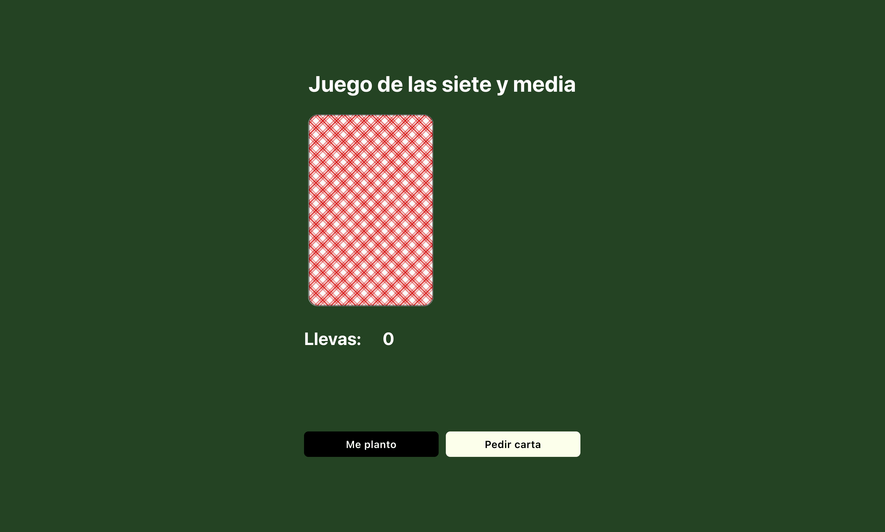

# Laboratorio--Ts4

## Ejemplo en vivo

- [Ver página](https://siete-y-media.onrender.com/)

## Descripción 📑

Juego de las Siete y Media, creado con Html5, Css3, y Typescript, con Vite como builder.

## ¿Qué he aprendido en este proyecto? 🙇🏻

## Tecnologías 🛠

<!-- Iconos sacados de: https://github.com/hendrasob/badges/blob/master/README.md y https://github.com/alexandresanlim/Badges4-README.md-Profile -->

>)

## Autor ✒️

**Leticia de la Osa**

- [contacto@deletidev.com](mailto:contacto@deletidev.com)
- [LinkedIn](https://www.linkedin.com/in/deletidev)
- [Mi porfolio web](https://deletidev.com/)

## Instalación ⚙️

- Clonate el proyecto.
- Instala las dependencias con `npm install`.
- Ejecuta el sandbox con `npm run dev` o primero `npm run build` seguido de `npm run preview`.
- Abre el navegador en `http://localhost:4173/` (si ese puerto no te funciona, mira en la consola donde has hecho el build, puede que este ocupado y se haya abierto en otro puerto).

## Licencia 📄

MIT Public License v3.0
No puede usarse comercialmente.
